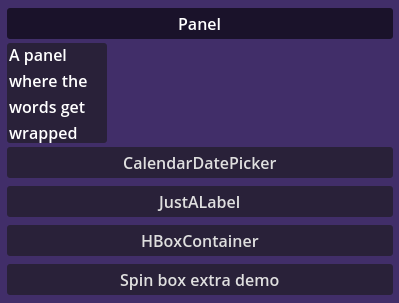
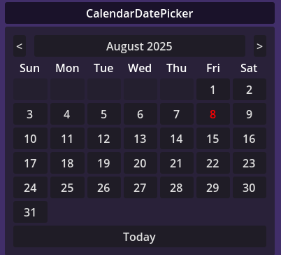
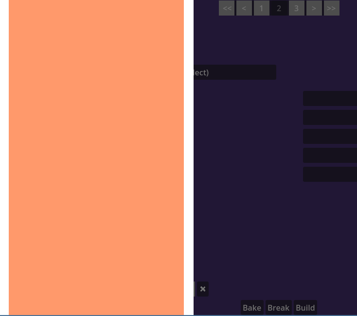
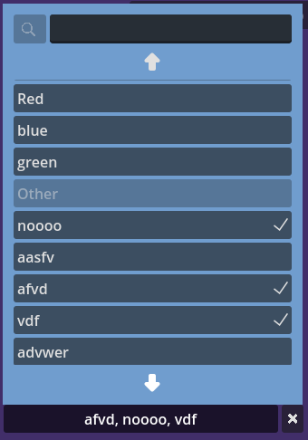

# Extra Godot UI Controls
Extra UI control for Godot, compatible with Themes.

# Installation 
Copy files anywhere in your project. Add any of the .tscn to your scene to use them. 

# Components
- Accordion: Collapsible sections. Automatically creates the toggle buttons that collapse each segment. transition_duration sets the speed of animation when changing segments. Starting_Item will be the open item, if set.  
- ButtonGroupControl: each Button child will automatically share button group   
- CalendarDatePicker: set_date() function and date_selected signal use a dictionary with "Year", "Month", and "Day  
- DateTimePicker: set_datetime() function and datetime_changed signal use a dictionary with keys "year", "month", "day", "hour", and "minute". Display month as number or text 
 
- Modal: Choose direction, dimming_amount, and tween duration. Can assign a trigger_button to toggle open/close or use code. close_on_click_outside will close the modal if it loses focus. relative_position will use local position instead of global 
- OptionButtonSpinbox: options is a string with "\n" between each option. Option for single select or multiple select. Max_visible_options can limit the height of the popup. Automatically chooses if popup should be above or below. Can set font_size. Search optional. Up/Down buttons that scroll on hover optional.  
- Pagination: Set the page count, and current page. 
- PanelMarginContainer: A panel container, with a margin container, with a choice of HBox, Vbox, HFlow, VFlow, or Tab Container. Press the "(re)create" button in Inspector to update if you change type.
- SpinBoxExtra: A better spinbox with more themeing options. Options shuold be a string with "\n"between each option. Options can loop be looped. There are settings for font size, margins, show/hide updown buttons. Theer is a value_changed(text) signal.  
- SpinBoxButtons: up down buttons for spinbox. can be used separately with an up() and a down() signal  
- TextInput: An alternative to LineEdit that has signal text_change_requested(orignal_text, new_text). This allows you to validate before committing, and call reset_text() if not valid. Also has an option to pre-validate for int, float, or number

# How To Theme
When you set a theme_variation for a component, it updates it's children's theme_variations
e.g. If you set an Accordion's theme_type_variation to "accordion_red", it's buttons will have theme_type_variation "accordion_red_button"

##### List Of Suffixes:
Accordion: "_button"
Calendar: "_calendar_day", "_calendar_day_selected"
OptionButtonSpinBox: "_scroll_buttons", "_panel", "_toggle_button", "_button", "_options_vbox", "_search", "option_heading_button", "option_button"
Pagination: "_navigation_button", "_page_button"